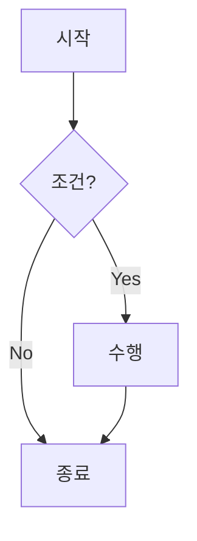

# oulico.github.io 블로그

이 프로젝트는 React, TypeScript, Vite를 사용하여 만들어진 개인 블로그입니다.


## 새 포스트 작성 방법

새로운 블로그 포스트를 작성하는 과정은 다음과 같습니다.

### 1. 마크다운 파일 생성

`src/posts/` 디렉토리에 새로운 `.md` 파일을 생성합니다. 파일 이름은 URL의 일부가 됩니다.

- **예시:** `my-new-post.md` 파일을 생성하면, 해당 포스트의 URL은 `/posts/my-new-post`가 됩니다.

### 2. Frontmatter 추가

마크다운 파일의 최상단에 YAML 형식의 frontmatter를 추가하여 포스트의 메타데이터를 설정합니다.

```yaml
---
title: "포스트 제목"
date: "YYYY-MM-DD"
category: "카테고리"
tags: ["태그1", "태그2"]
---
```

- `title`: 포스트의 제목
- `date`: 포스트 작성일
- `category`: 포스트의 대분류 카테고리
- `tags`: 포스트에 사용할 태그 목록 (배열)

### 3. 컨텐츠 작성

Frontmatter 아래에는 [Markdown](https://www.markdownguide.org/basic-syntax/) 문법을 사용하여 포스트 본문을 작성합니다.

#### 특별 기능

이 블로그에서는 일반 Markdown 외에 다음과 같은 특별 기능을 지원합니다.

##### Mermaid 다이어그램



위와 같이 `mermaid` 코드 블록을 사용하면 다이어그램을 렌더링할 수 있습니다.

##### 이미지 ASCII 아트 변환

마크다운의 표준 이미지 문법을 사용하면, 빌드 시 이미지가 자동으로 ASCII 아트로 변환되어 본문에 삽입됩니다.

- **사용법:** ``
- 이미지 경로는 마크다운 파일을 기준으로 한 상대 경로 또는 프로젝트 루트에서 시작하는 절대 경로를 사용할 수 있습니다.
- `이미지 설명`(alt text)은 ASCII 아트의 제목으로 사용됩니다.

**예시:**
```markdown

```

### 4. 포스트 빌드 및 확인

포스트 작성이 완료되면, 변경사항을 빌드하여 정적 파일로 만들어야 합니다.

1.  **포스트 빌드**
    `bun scripts/build-posts.ts` 명령어를 실행하여 `src/posts`에 있는 마크다운 파일들을 처리합니다. 이 스크립트는 `bun run build` 실행 시 자동으로 먼저 실행됩니다.

2.  **로컬 개발 서버 실행**
    `bun run dev` 명령어로 개발 서버를 실행하여 작성한 포스트를 웹 브라우저에서 확인할 수 있습니다.

3.  **프로덕션 빌드**
    `bun run build` 명령어로 전체 프로젝트를 빌드합니다.