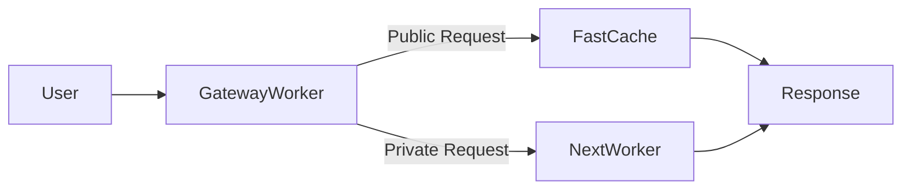

# **블로그 플랫폼에서의 문제 1 **

## **본인만 볼 수 있는 글이 존재할 때, 캐싱은 어떻게 해야 하는가**

블로그 플랫폼을 만들다 보면 언젠가는 반드시 마주치게 되는 문제가 있다.

> **“이 글은 공개 글인가, 아니면 작성자만 볼 수 있는 글인가?”**

처음에는 단순해 보인다.

SSR로 렌더링하고, 프레임워크 캐싱에 맡기면 되는 것처럼 느껴진다.

하지만 **엣지 환경에서 캐싱을 적극적으로 사용하기 시작하는 순간**,

이 문제는 단순한 구현 문제가 아니라 **구조의 문제**가 된다.

---

## **문제를 단순화해보자**

이 문제를 제대로 이해하려면, 질문을 바꿔야 한다.

❌ _“SSR이냐 ISR이냐?”_

❌ _“Next.js 캐싱 옵션을 어떻게 설정하느냐?”_

대신, 다음 질문이 핵심이다.

> **이 응답은 다른 사용자와 공유되어도 안전한가?**

이 질문에 대한 답이 **Yes / No**로 명확하게 갈리는 순간,

캐싱 전략은 자연스럽게 분리된다.

---

## **흔한 오해: “SSR이면 괜찮지 않나?”**

자주 나오는 생각은 이것이다.

> “어차피 SSR이면 요청마다 렌더링하니까,
> 공개 글이든 비공개 글이든 문제 없는 거 아닌가?”

부분적으로는 맞다.

**SSR 자체는 안전하다.**

하지만 엣지 환경에서는 문제가 달라진다.

- Cloudflare Worker
- OpenNext 어댑터
- Cache API
- KV 기반 ISR 캐시

이 조합에서 **SSR 결과는 쉽게 캐시된다**.

그리고 캐시는 **사용자를 구분하지 않는다**.

즉,

- 인증된 사용자가 비공개 글을 요청
- SSR 결과가 캐시됨
- 다음 요청에서 인증 없는 사용자에게 재사용됨

이 순간, **캐시 오염(cache contamination)** 이 발생한다.

문제는 “SSR이냐 아니냐”가 아니라,

**캐시 경계가 어디에 존재하느냐**다.

---

## **멘탈 모델: 요청은 어디서 분기되어야 하는가?**

이 문제를 해결하기 위해 필요한 멘탈 모델은 단순하다.

> **캐시 가능한 경로와, 캐시 불가능한 경로를 구조적으로 분리한다**

이를 시각적으로 표현하면 다음과 같다.

핵심은 **렌더링 이전**에 결정이 내려진다는 점이다.

- 이 요청은 **공개 콘텐츠인가?**
- 아니면 **인증이 필요한 개인 콘텐츠인가?**

이 판단이 늦어질수록, 캐시는 위험해진다.

---

## **Cloudflare 환경에서의 명확한 역할 분리**

이 프로젝트는 OpenNext 어댑터를 사용해

Next.js를 **Cloudflare Worker 환경**에 배포한 구조다.

여기서 중요한 것은 **정확한 명칭과 책임 분리**다.

### **Terminology**

- **Cloudflare Edge**
    → 실행 위치 (PoP)
- **Gateway Worker**
    → 모든 요청의 진입 지점
    → 인증 여부 판단
    → 캐시 가능성 판단
- **Next.js Worker**
    → SSR / ISR 실행
    → 순수 렌더링 담당
- **Fast Path Cache**
    → Gateway Worker의 Cache API
    → 공개 콘텐츠 전용
- **ISR Cache**
    → KV 기반 페이지 캐시
    → 정적 재생성 전용

명확한 네이밍은

시스템을 이해하기 쉽게 만들 뿐 아니라,

**코드베이스를 읽는 도구(예: Claude Code)** 에게도 큰 도움이 된다.

모든 개념에 이름이 붙는 순간,

구조는 설명 가능한 것이 된다.

---

## **왜 이 구조가 잘 동작하는가**

이 아키텍처의 장점은 명확하다.

- 공개 콘텐츠는 엣지에서 **공격적으로 캐싱**
- 비공개 콘텐츠는 **절대 캐시되지 않음**
- 두 경로는 **구조적으로 만날 수 없음**

즉,

> 캐시 오염은 실수로 발생하는 문제가 아니라
> **설계가 허용할 때만 발생하는 문제**다.

이 구조에서는 애초에 허용되지 않는다.

그리고 무엇보다 중요한 점은

**시스템의 동작이 예측 가능해진다는 것**이다.

---

## **결론**

이 문제는 성능 튜닝의 문제가 아니었다.

프레임워크 기능의 문제가 더더욱 아니었다.

핵심 질문은 이것이었다.

> **어떤 데이터가 공유되어도 안전한가?**

이 질문에 대한 답을 구조로 고정하는 순간,

캐싱 전략은 더 이상 고민거리가 아니다.

그 이후의 모든 것은

구현 디테일에 불과하다.
