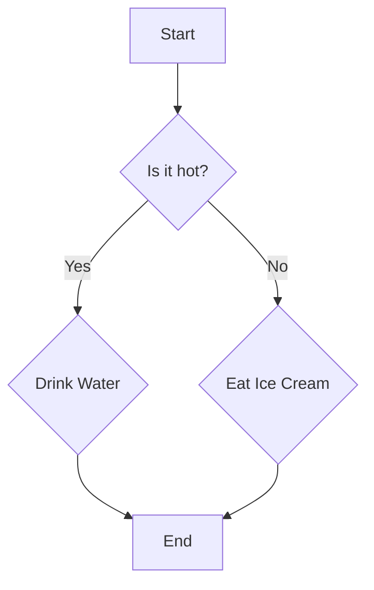

## Welcome to my new blog!

This is my very first post. I'm excited to start writing.

Here is a code block:
```javascript
console.log("Hello, from the new blog!");
```


## Mermaid Diagram Example



